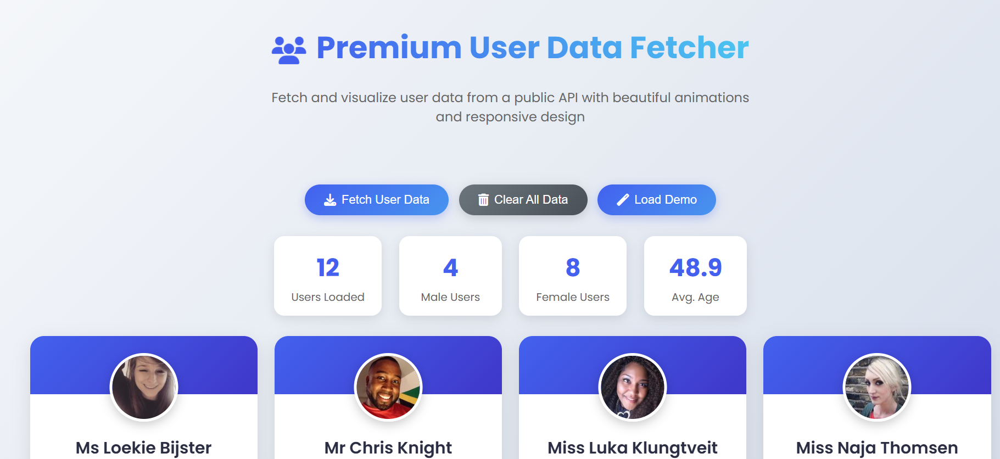

Premium User Data Fetcher
https://via.placeholder.com/800x500/4361ee/ffffff?text=Premium+User+Data+Fetcher+UI

A visually stunning web application that fetches and displays user data from public APIs with beautiful animations and a modern UI design.

Features
🌟 Animated UI elements with smooth transitions

📊 Real-time user statistics dashboard

🚀 API data fetching using Fetch API

📱 Fully responsive design

💫 Interactive elements with hover effects

🛠 Error handling with retry functionality

🌈 Modern gradient design

Live Demo
View Live Demo
https://premiumuserdatafetcher.netlify.app/

Technologies Used
HTML5

CSS3 (Flexbox, Grid, Animations)

JavaScript (Fetch API)

Font Awesome Icons

Google Fonts

Installation
Clone the repository:

bash
git clone https://github.com/your-username/user-data-fetcher.git
Open index.html in your browser

Usage
Click "Fetch User Data" to retrieve real user information

View detailed user profiles

Examine statistics dashboard

Use "Clear All Data" to reset

Try "Load Demo" for sample data

API Reference
Uses Random User Generator API

Endpoint:

text
https://randomuser.me/api/?results=12
License
This project is licensed under the MIT License.

